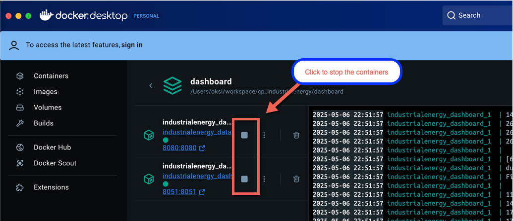
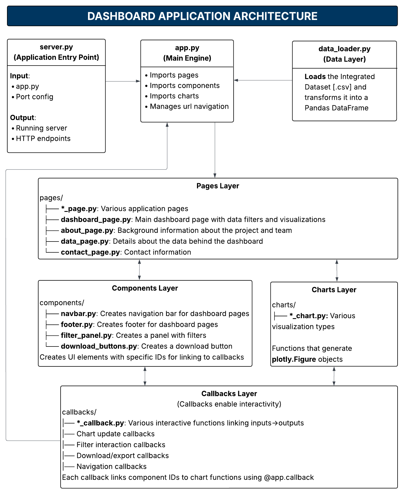

# Dashboard for the Industrial Energy Data Exploration Interface

The Industrial Energy Dashboard is a web-based analytics platform built with Python Dash that enables interactive exploration of industrial energy efficiency program data. The system processes raw energy datasets and presents them through dynamic visualizations with real-time filtering capabilities.


## Repository organization

The repo is structured in a way that allows modular development of the dashboard application. This structure enables multiple users to work independently on different components of the project without creating merge conflicts or duplicating work. Each component, such as a chart or a table, can be developed simultaneously, thus contributing to parallel application development by the project team.

The organization of the repo follows best practices:
* **Clear modular structure**: Separate folders for building blocks of the application support collaborative development.
* **Specialized directories**: Dedicated directories for different chart types and components support clean code organization.
* **Support files**: Support directories and files allow for future project maintenance.

```
.
├── Dockerfile
├── assets
│   ├── isalab-logo.png
│   └── styles.css
├── data
│   ├── *.xlsx
├── environment.yml
└── tools
│   ├── *_data_update.* (.cmd, .sh)
└── dashboard_app
    ├── app.py
    ├── server.py
    ├── sql_scrips.py
    │   ├── *_script.py
    ├── callbacks
    │   ├── *_callback.py
    ├── charts
    │   ├── *_boxplot_chart.py
    │   ├── *_bar_chart.py
    │   ├── *_line_chart.py
    │   ├── *_monitor_chart.py
    │   ├── *_timeseries_chart.py
    │   ├── styles.py
    ├── notebooks
    ├── components
    │   ├── *_table.py
    │   ├── download_button.py
    │   ├── filter_panel.py
    │   ├── footer.py
    │   ├── navbar.py
    ├── layouts
    │   └── base_layout.py
    ├── pages
    │   ├── about_page.py
    │   ├── dashboard_page.py
    │   ├── trends_page.py
    │   ├── docs_page.py
    ├── server.py
├── test
│   ├── * (test files)
├── docs
│   ├── architecture.md
│   ├── deployment.md
│   ├── data_update.md

```
## Installation Instructions

### Configure the environment
1. Install VS Code if you don’t have it yet.
   `https://code.visualstudio.com/`
2. Install Anaconda if you don’t have it yet.
3. Clone the repo from Git. In the terminal, run:  
   ```bash
   git clone <git repo link>
   ```
4. Create a new conda environment. In the terminal, run: \
`conda env create -f environment.yml`
5. Activate the conda environment. In the terminal, run: \
`conda activate industrialenergy`
6. Update the file structure on your local machine by creating missing folders (e.g. some folders are in .gitignore and are not in the remote repo): refer to the section `Repository Organization` in this README.md.
7. Copy dataset file from the google drive: [iac_integrated_dash.csv](https://drive.google.com/drive/folders/1LedCwOiKBOrt5Ovrrthjz41Pz59wet7Q?dmr=1&ec=wgc-drive-globalnav-goto) to the `data` folder. 

### Run the dashboard app (locally)
**Locally without docker**:
1. Ensure that you are in the root folder.
2. In the terminal run: \
    `python dashboard_app/server.py`
3. Run the dashboard in a browser on your local machine: \
    http://localhost:8051/dashboard

**Locally in docker**:
1. Install docker desktop \
    `https://docs.docker.com/desktop/`
2. Launch docker desktop
3. Build the docker image
    1. Ensure that you are in the root folder of the dashboard app
    2. In the terminal run command to build the app: \
        `docker-compose up --build`
4. Open the dashboard in a browser on your local machine:\
    http://localhost:8051/dashboard
5. Alternatively, view the dashboard and the data server in the docker dashboard: 
    
6. Stop the docker container when you are done with the dashboard. 
    1. In the terminal run: \
        `docker-compose down`
    2. Alternatively, stop the container in the docker desktop dashboard: \
        


## Web Application Architecture 

## 🏗️ **Core Architecture**



**server.py**: Application entry point that configures and starts the web server \
**app.py**: Application controller that imports all components, manages routing, and initializes interactivity \
**data_loader.py**: Data access layer that loads and processes the integrated CSV dataset into pandas DataFrame

### **Modular Component Organization**
The application follows a modular design with four specialized layers:

- **📄 Pages**: Define page layouts and structure (`pages/`)
- **🧩 Components**: Reusable UI elements like filters and navigation (`components/`)  
- **📊 Charts**: Visualization functions that generate interactive plots (`charts/`)
- **⚡ Callbacks**: Interactive logic linking user inputs to chart updates (`callbacks/`)


## 🔄 **Key System Flows**

### **1. Data Flow**
```
Raw CSV Files → data_loader.py → pandas DataFrame → app.py → Components/Charts
```
Data is loaded once at startup and cached in memory for fast filtering and visualization.

### **2. User Interaction Flow**  
```
User Selects Filter → Callback Triggered → Data Filtered → Chart Updated → UI Refreshed
```
All interactions happen client-side without page reloads, providing responsive user experience.

### **3. Component Integration Flow**
```
app.py imports → Pages import Components/Charts → Callbacks link IDs → Live Interactivity
```
Each component layer builds on the previous, with callbacks providing the "glue" between UI elements and data processing.

---

## 🔧 **Adding New Features**

### **New Visualization Workflow**
1. **Create chart function** in `charts/` (data → plotly figure)
2. **Create callback** in `callbacks/` (link filters → chart updates)  
3. **Add to page layout** in `pages/` (import and position chart)
4. **Initialize callback** in `app.py` (register with Dash app)


## Version Control Practices

Branching Strategy

* **Main Branch:** The main or master branch should always be stable and ready for production. No direct commits should be made to this branch.
* **Development Branch:** This is where ongoing work is done and merged into after testing. Create feature branches from development for new work.
* **Feature Branches:** Each feature or bug fix should be developed in a separate branch. Once the feature is complete and tested, it can be merged into the development branch.
* **Release Branches:** Once feature branches are merged, a release branch can be created to prepare for production deployment.

Merge Strategy

* **Squash Merging:** Maintains a clean and readable commit history, this combines all commits from a feature branch into a single commit when merging into the development or main branch.
* **Rebase:** Keeps the commit history linear and clean by applying changes on top of the latest main branch. Ideal for local or private branches, avoid with shared branches.
* **Tagging:** Whenever possible tag to mark version releases and key milestones. This makes it easier to track and reference specific versions of the code.

## Testing Strategy

* **Unit Testing:** For individual components, functions, and methods covering typical use cases.
* **Integration Testing:** To test how different modules interact. For example, test how the filter_panel.py interacts with various charts and tables.
* **User Acceptance Testing (UAT):** Ensures the product meets the requirements set by stakeholders. This involves running tests on the entire dashboard to simulate real user interactions.

## Contribution Guidelines
*Outline the process to contribute to the project*

## Authors

Student Authors: Oksana Protsukha, Naomi Moraes, Eva Newby, Yos Ramirez.

Capstone Advisor: Dr. Eric Masanet
