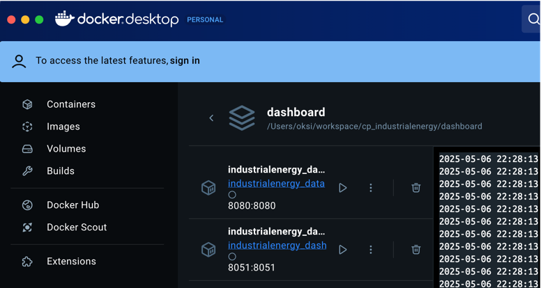

# Dashboard for the Industrial Energy Data Exploration Interface
Web application for Industrial Energy Capstone Project

## Repository organization

The repo is structured in a way that allows modular development of the dashboard application. This structure enables multiple users to work independently on different components of the project without creating merge conflicts or duplicating work. Each component, such as a chart or a table, can be developed simultaneously, thus contributing to parallel application development by the project team.

The organization of the repo follows best practices:
* **Clear modular structure**: Separate folders for building blocks of the application support collaborative development.
* **Specialized directories**: Dedicated directories for different chart types and components support clean code organization.
* **Support files**: Support directories and files allow for future project maintenance.

```
.
├── Dockerfile
├── assets
│   ├── isalab-logo.png
│   └── styles.css
├── data
│   ├── *.xlsx
├── environment.yml
└── tools
│   ├── *_data_update.* (.cmd, .sh)
└── dashboard_app
    ├── app.py
    ├── server.py
    ├── sql_scrips.py
    │   ├── *_script.py
    ├── callbacks
    │   ├── *_callback.py
    ├── charts
    │   ├── *_boxplot_chart.py
    │   ├── *_bar_chart.py
    │   ├── *_line_chart.py
    │   ├── *_monitor_chart.py
    │   ├── *_timeseries_chart.py
    │   ├── styles.py
    ├── notebooks
    ├── components
    │   ├── *_table.py
    │   ├── download_button.py
    │   ├── filter_panel.py
    │   ├── footer.py
    │   ├── navbar.py
    ├── layouts
    │   └── base_layout.py
    ├── pages
    │   ├── about_page.py
    │   ├── dashboard_page.py
    │   ├── trends_page.py
    │   ├── docs_page.py
    ├── server.py
├── test
│   ├── * (test files)
├── docs
│   ├── architecture.md
│   ├── deployment.md
│   ├── data_update.md

```
## Installation Instructions

### Configure the environment
1. Install VS Code if you don’t have it yet.
   `https://code.visualstudio.com/`
2. Install Anaconda if you don’t have it yet.
3. Clone the repo from Git. In the terminal, run:  
   ```bash
   git clone <git repo link>
   ```
4. Create a new conda environment. In the terminal, run: \
`conda env create -f environment.yml`
5. Activate the conda environment. In the terminal, run: \
`conda activate industrialenergy`
6. Update the file structure on your local machine by creating missing folders (e.g. some folders are in .gitignore and are not in the remote repo): refer to the section `Repository Organization` in this README.md.
7. Copy dataset file from the google drive: [iac_integrated_dash.csv](https://drive.google.com/drive/folders/1LedCwOiKBOrt5Ovrrthjz41Pz59wet7Q?dmr=1&ec=wgc-drive-globalnav-goto) to the `data` folder. 

### Run the dashboard app (locally)
**Locally without docker**:
1. Ensure that you are in the root folder.
2. In the terminal run: \
    `python dashboard_app/server.py`
3. Run the dashboard in a browser on your local machine: \
    http://localhost:8051/dashboard

**Locally in docker**:
1. Install docker desktop \
    `https://docs.docker.com/desktop/`
2. Launch docker desktop
3. Build the docker image
    1. Ensure that you are in the root folder of the dashboard app
    2. In the terminal run command to build the app: \
        `docker-compose up --build`
4. Open the dashboard in a browser on your local machine:\
    http://localhost:8051/dashboard
5. Alternatively, view the dashboard and the data server in the docker dashboard: 
    
6. Stop the docker container when you are done with the dashboard. 
    1. In the terminal run: \
        `docker-compose down`
    2. Alternatively, stop the container in the docker desktop dashboard: \
        


## Web Application Architecture 
Each module in this web application interacts with others to form the complete system.

* **Dashboard Page:** The dashboard_page.py serves as the central page, calling various components, charts, and tables from the components, charts, and layouts directories. Data for these components is pulled from various sources (e.g., data/.xlsx., py scripts)
* **Callbacks:** The callbacks module contains Python code that defines interactivity on the dashboard, such as filtering data or updating charts. These callback functions interact with the UI elements like buttons, charts, and tables. For example, the filter_panel.py triggers updates on charts and tables when users select new filters.
* **Charts and Components:** Modules under the charts directory represent different types of visualizations, each of which receives data from the data folder and can be updated. Components like the navbar.py and footer.py are essential for the overall layout, providing a consistent user experience.
* **Server:** The server.py file handles the setup of the application’s backend, configuring the server and handling requests to render different pages and serve dynamic content. It connects to the dashboard_page.py, about_page.py, and other page modules.
* **Testing:** The test directory contains unit tests for different components and modules. Each module has corresponding tests, for example testing the functions in charts or verifying the interactivity of filter_panel.py. 

## Version Control Practices

Branching Strategy

* **Main Branch:** The main or master branch should always be stable and ready for production. No direct commits should be made to this branch.
* **Development Branch:** This is where ongoing work is done and merged into after testing. Create feature branches from develop for new work.
* **Feature Branches:** Each feature or bug fix should be developed in a separate branch. Once the feature is complete and tested, it can be merged into the develop branch.
* **Release Branches:** Once features are merged, a release branch can be created to prepare for production deployment.

Merge Strategy

* **Squash Merging:** Prefer using squash merging for cleaner commit history. It squashes all your commits in a branch into one before merging.
* **Rebase vs. Merge:** Consider using rebase to keep your commit history linear, but be cautious when rebasing shared branches.

Consider tagging in Git for easy tracking of versions of the code and releases. 

## Testing Strategy

* **Unit Testing:** For individual components, functions, and methods covering typical use cases and edge cases.
* **Integration Testing:** Test how different modules interact. For example, test how the filter_panel.py interacts with various charts and tables.
* **User Acceptance Testing (UAT):** Ensures the application meets the requirements set by stakeholders. This involves running tests on the entire dashboard to simulate real user interactions.

## Contribution Guidelines
*Outline the process to contribute to the project*

## Authors

Student Authors: Oksana Protsukha, Naommi Moraes, Yos Ramirez, Eva Newby.

Capstone Advisor: Dr. Eric Masanet
